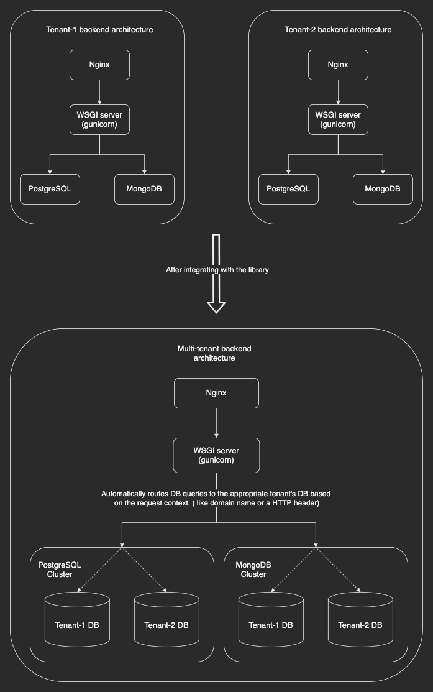

# About

This project is a PoC of how a pip installable re-usable Django app can be built in order to convert a conventionally built single-tenant Django application into its multi-tenant version with minimal/no code change.

Traditionally SAAS platforms have adopted multiple approaches to achieving multi-tenancy. The two most common and widely used are the following:

1. Isolated DB approach -> Each tenant stores its data in a separate database.
2. Shared DB approach -> Data from multiple tenants are collocated in the same database but every row relates to a specific tenant by means of a database relation constraint.

This project adopts the first (isolated DB) approach due to the following reasons:

1. Typically SAAS platforms have an SLA stating that every tenant's data has to be complete isolated from one another so as to avoid potential data leaks or data overlap.
2. If the shared DB approach is chosen, it would entail both code change as well as DB schema changes/migrations etc., which can be time consuming for already running live applications to accomodate.
3. Most of the tools around DB management (like DB dump/restore, monitoring etc.,) are built to operate at the database level. If the shared DB approach is chosen, then these tools would either become obsolete or would have to be used with modifications made on a case-to-case basis and ends up becoming a bottle-neck for the migration process.
4. Currently there is no general purpose package/library that can be plugged into existing single-tenant applications to make them multi-tenant by following this approach.

The following architecture diagram explains better as to what the package/library achieves:

> **NOTE**: The term *package/library* used above refers to the [tenant_router](mt_site/tenant_router) Django app which is currently a part of the web appication made for demonstrating the PoC. However, it has been built in such a way that it can be abstracted out into a re-usable pip installable app that can be plugged into any existing Django web application to solve the multi-tenancy problem.

# How does it work?

The library essentially solves two major problems:

1. **Routing DB queries to appropriate tenant DBs' at runtime**: This is one of the core components of the library. This is achieved by creating a connection management and routing layer on top of DB wrapper/connector libraries (like ORMs') thereby making the solution database agnostic. 

2. **Real time propagation of tenant configuration changes**: To elaborate on the problem, any configuration change (like DB url, cache url etc.,) that happens when an Add tenant/Update tenant/Delete tenant takes place, has to be communicated to and processed by all running instances of the app server at any given time. This is solved by means of a niche Pub/Sub mechanism in place which we term as ***reactive configuration***.

Apart from the above mentioned solutions, the library also offers out-of-the-box support for various other components that a typical Django web app would use. These include:

1. Caches
2. Database migrations
3. Celery
4. Shell operations
5. Unit testing methods in this new paradigm
6. Management commands (like migrate, dumpdata, loaddata etc.,)

> **NOTE**: Of the components mentioned above, the code in this repo contains support for only a few of them as this is just for demonstration pruposes. However, ideas by which support can be extended for the other components will be discussed in the conference.

# Usage

