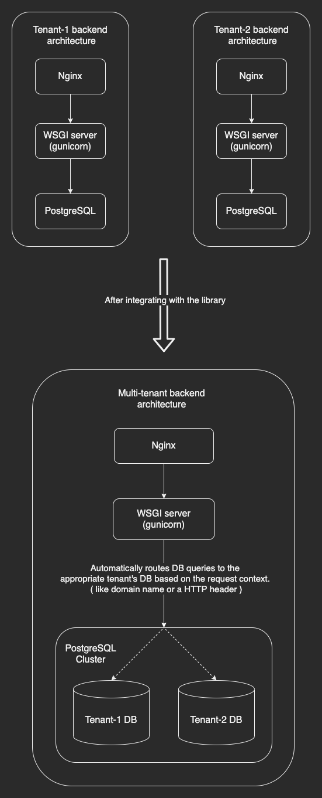
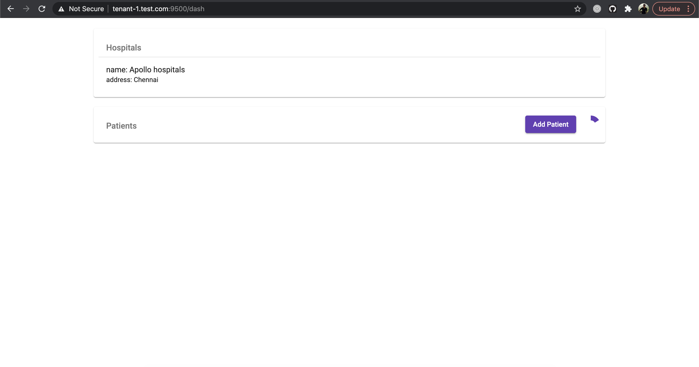
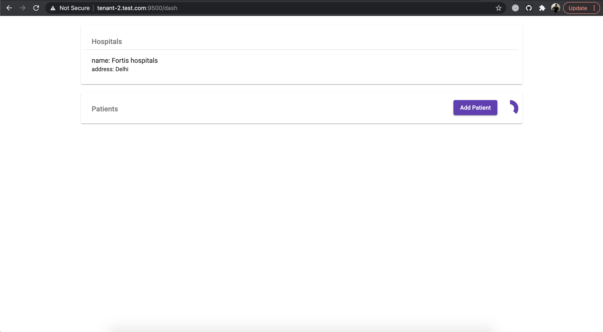
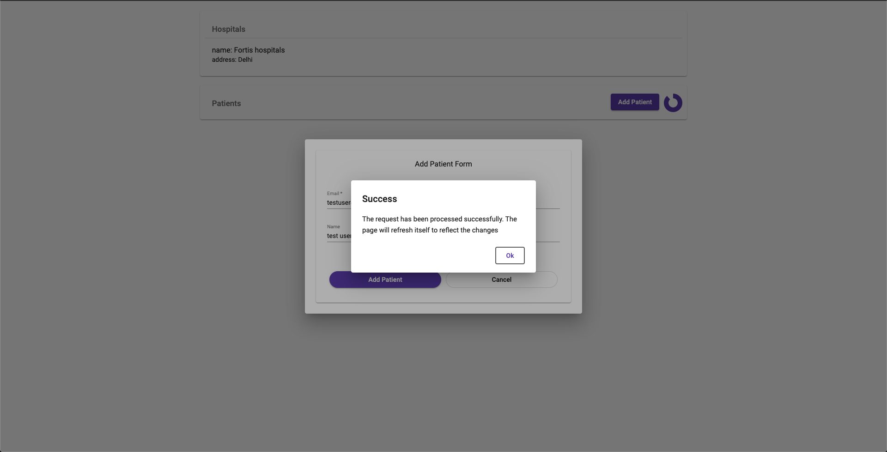

# About

This project is a PoC of how a pip installable re-usable Django app can be built in order to convert a conventionally built single-tenant Django application into its multi-tenant version with minimal/no code change.

Traditionally SAAS platforms have adopted multiple approaches to achieving multi-tenancy. The two most common and widely used are the following:

1. Isolated DB approach -> Each tenant stores its data in a separate database.
2. Shared DB approach -> Data from multiple tenants are collocated in the same database but every row relates to a specific tenant by means of a database relation constraint.

This project adopts the first (isolated DB) approach due to the following reasons:

1. Typically SAAS platforms have an SLA stating that every tenant's data has to be complete isolated from one another so as to avoid potential data leaks or data overlap.
2. If the shared DB approach is chosen, it would entail both code change as well as DB schema changes/migrations etc., which can be time consuming for already running live applications to accomodate.
3. Most of the tools around DB management (like DB dump/restore, monitoring etc.,) are built to operate at the database level. If the shared DB approach is chosen, then these tools would either become obsolete or would have to be used with modifications made on a case-to-case basis and ends up becoming a bottle-neck for the migration process.
4. Currently there is no general purpose package/library which is battle-tested and production ready that can be plugged into existing single-tenant applications to make them multi-tenant by following this approach. ([django-db-multitenant](https://github.com/mik3y/django-db-multitenant) has been deemed experimental by the authors)

The following architecture diagram explains better as to what the package/library achieves:



> **NOTE**: The term *package/library* used above refers to the [tenant_router](mt_site/tenant_router) Django app which is currently a part of the web appication made for demonstrating the PoC. However, it has been built in such a way that it can be abstracted out into a re-usable pip installable app that can be plugged into any existing Django web application to solve the multi-tenancy problem.


# How does it work?

The library essentially solves two major problems:

1. **Routing DB queries to appropriate tenant DBs' at runtime**: This is one of the core components of the library. This is achieved by creating a connection management and routing layer on top of DB wrapper/connector libraries (like ORMs') thereby making the solution database agnostic. 

2. **Real time propagation of tenant configuration changes**: To elaborate on the problem, any configuration change (like DB url, cache url etc.,) that happens when an Add tenant/Update tenant/Delete tenant takes place, has to be communicated to and processed by all running instances of the app server at any given time. This is solved by means of a niche Pub/Sub mechanism in place which we term as ***reactive configuration***.

Apart from the above mentioned solutions, the library also offers out-of-the-box support for various other components that a typical Django web app would use. These include:

1. Caches
2. Database migrations
3. Celery
4. Shell operations
5. Unit testing methods in this new paradigm
6. Management commands (like migrate, dumpdata, loaddata etc.,)

> **NOTE**: Of the components mentioned above, the code in this repo contains support for only a few of them as this is just for demonstration pruposes. However, ideas by which support can be extended for the other components will be discussed in the conference.

# Running the demo app

## Pre-requisites

The demo app comes in a completely dockerised setup. In order to launch it, it's mandatory to
have [Docker](https://www.docker.com/get-started) and 
[docker-compose](https://docs.docker.com/compose/install/) installed and available as part of
the system `PATH`.

Before launching the app, in order to verify its multi-tenant behaviour, a couple of host
entries namely `tenant-1.test.com` and `tenant-2.test.com` must be added to the namespace
resolver of your machine. Thus when the browser points to one of these hosts, the demo
app's backend would be able to route requests to the appropriate database. 

For Linux and MacOS users, please add the following entries to the `/etc/hosts` file as below:

```
##
# Host Database
#
# localhost is used to configure the loopback interface
# when the system is booting.  Do not change this entry.
##
...
127.0.0.1 tenant-1.test.com
127.0.0.1 tenant-2.test.com
...
# End of section
```

> **NOTE**: You might need to ensure that the current user has `sudo` privileges in order to edit the
`/etc/hosts` file.


## Launch

To launch the app, enter the following commands:

```shell
$ cd ~/multi-tenant-poc
$ docker-compose build
$ docker-compose up -d
```

To test things out, try the following:

1.  Open your browser and point it to `tenant-1.test.com:9500`. You should see the
    following image:
    
    

2.  Now, point the browser to `tenant-2.test.com:9500`. You should see the following image.
    
    
    
    You can see that, in the above image, the data for the **Hospitals** tab is different
    compared to the data that was displayed for `tenant-1.test.com`. This confirms that requests
    are being routed to different databases based on the domain name.
    
3.  As you can see, in both the above screens, the **Patients** tab is empty. Let's try adding one. 
    Click on the **Add Patient** button and fill up the form with the required details and submit
    it. You should see the following screen once submitted:
    
    
    
    By now, you would have noticed the small spinner near the **Add Patient** button. Every time the
    spinner completes one full rotation, the **Patients** tab is refreshed. 
    
    The reason for doing this is that the Add Patient HTTP endpoint does not immediately add the
    new patient to the database but rather delegates this responsibility to a 
    ***celery task***. Hence, the UI would be able to reflect the latest changes only after the
    celery task completes its execution.
    
    The aim of the above implementation is to illustrate that every *celery task* that the app
    has, when invoked, is bound to a specific tenant's context without any code changes. 
    
    > **INFO**: Verify the above statement by pointing your browser to `tenant-1.test.com:9500`. You 
    would find that the **Patients** tab is still empty.
    
